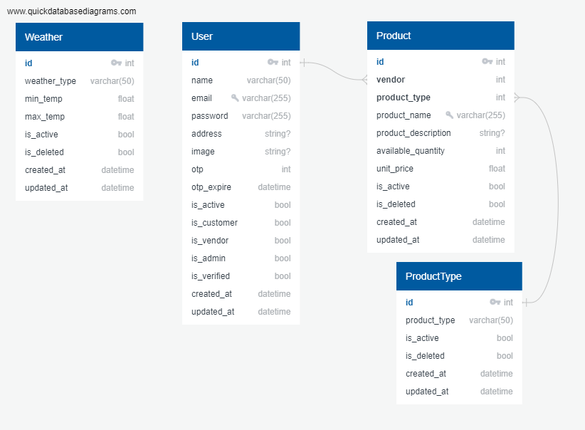

# Product Recommendation System

## Database Schema


## How to run:
### 1. Clone project
> Make sure you have already installed python3 and git.
```
git clone https://github.com/MeherajUlMahmmud/ProductRecommendationSystem
```

### 2. Create a virtual environment
> For Windows
```
py -m venv venv
```

> For Linux or Mac
```
python3 -m venv venv
```

### 3. Start the environment
> For Windows
```
.\venv\Scripts\activate
```

> For Linux or Mac
```
source venv/bin/activate
```

### 4. Create a .env file in the root directory and add the following:
```
DJANGO_SECRET_KEY=django-insecure-#j&78sak-l4=99-x@!^&q^4^!(szg&vg@u&zh09#%a+@ws0d3)
DJANGO_DEBUG=True
AUTHORIZATION_CODE=1234567890
JWT_SECRET_KEY=asdfghjkl
JWT_ALGORITHM=HS256
OPEN_WEATHER_API_KEY=087a8953e8025e4602f2c81d261295db
```

### 5. Install necessary libraries
> For Windows
```
pip install -r requirements.txt
```

> For Linux or Mac
```
pip3 install -r requirements.txt
```

### 5. Migrate the Database
> For Windows
```
py manage.py migrate
```

> For Linux or Mac
```
python3 manage.py migrate
```

### 6. And start your server
> For Windows
```
py manage.py runserver
```

> For Linux or Mac
```
python3 manage.py runserver
```

### 7. Download the Postman collection from the following link:
<a href="assets/ProductRecommendationSystem.postman_collection.json" download>Click to Download</a>
